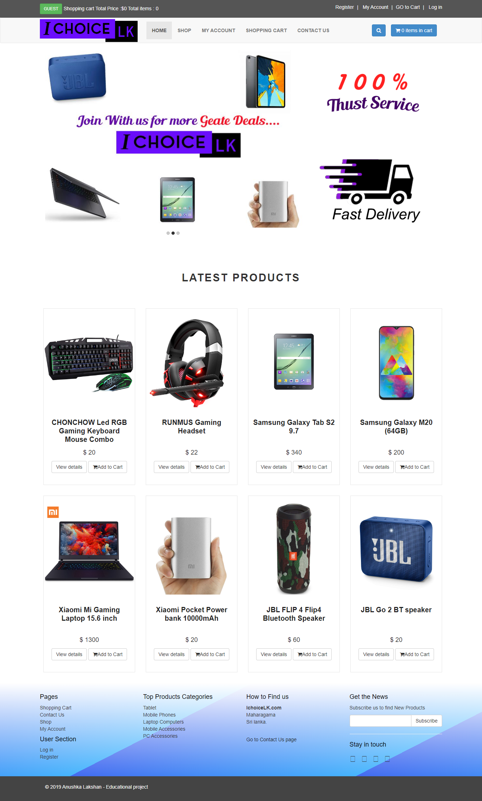
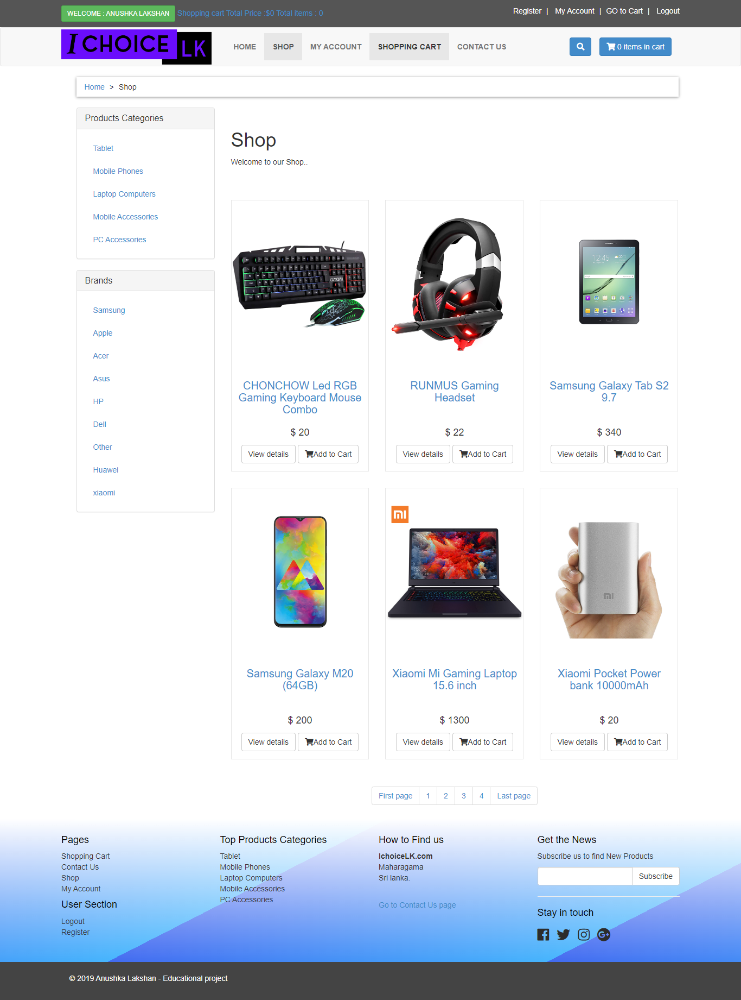
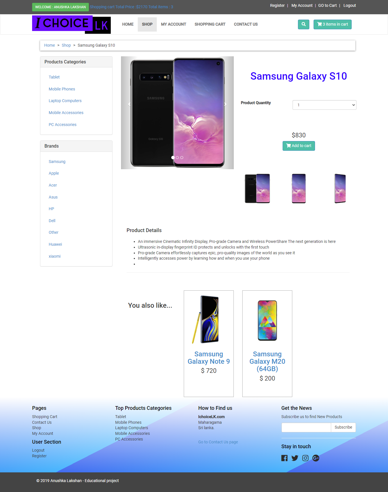
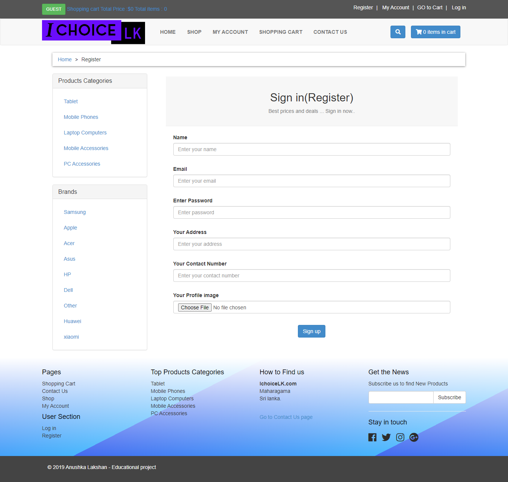
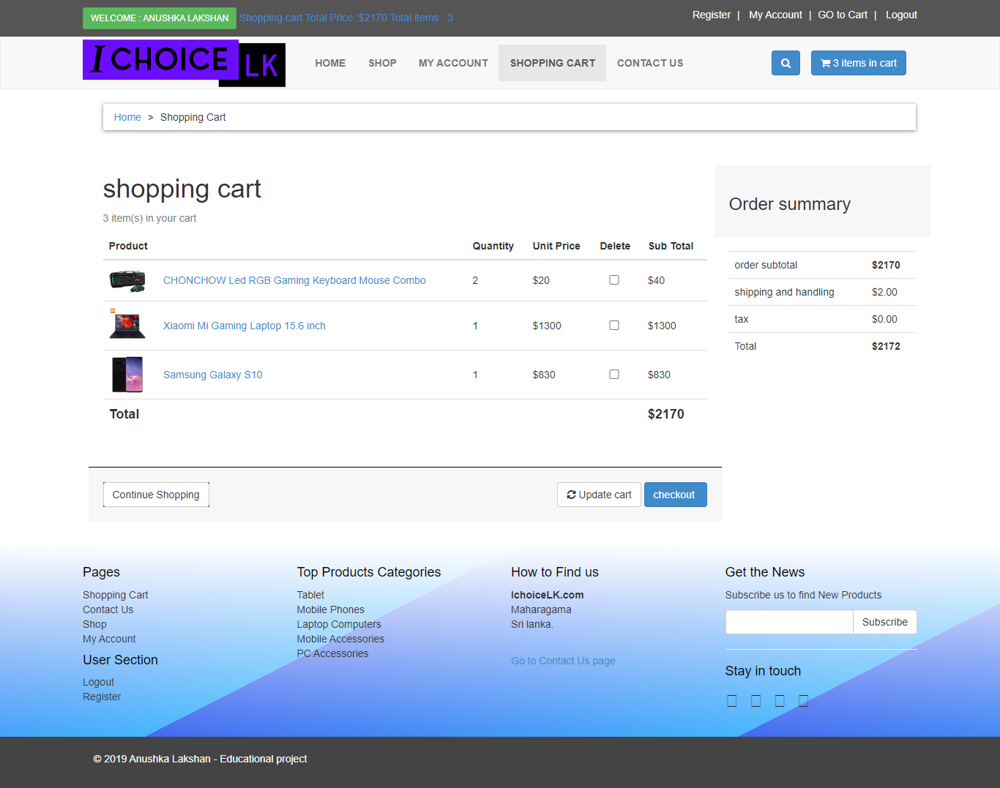
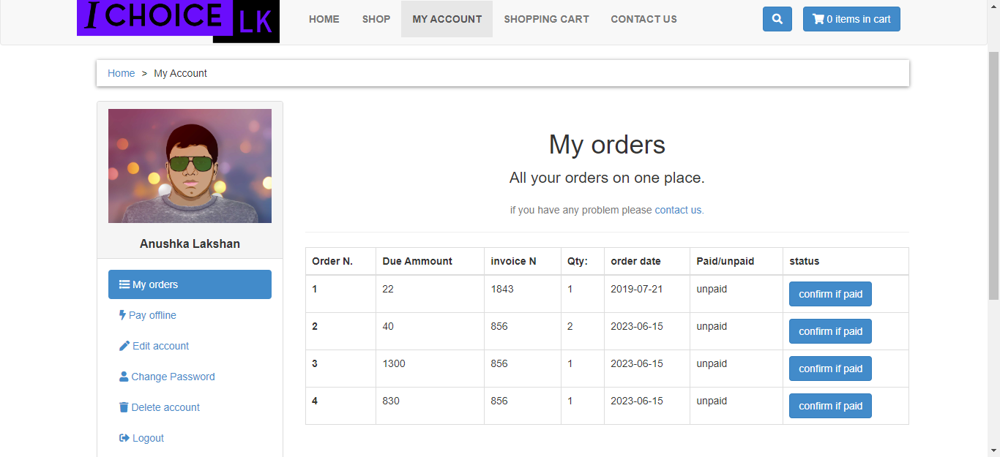
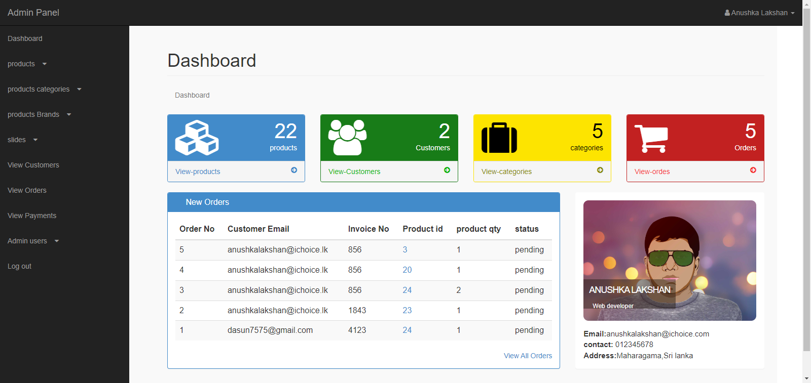
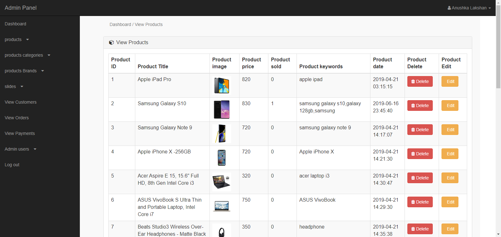
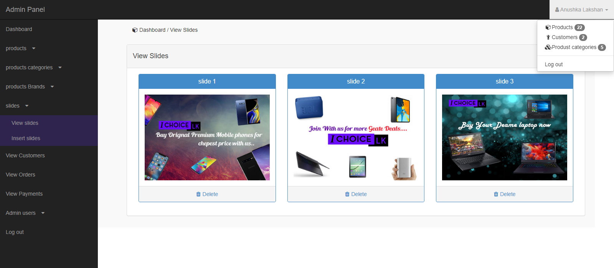

# IChoiceLK

IChoiceLK is an e-commerce website focused on selling technical gadgets such as smartphones, tablets, laptops, and accessories. This project was developed as an educational project.

## Demo

You can access the fully functioning demo of the website [here](http://ichoicelk.dx.am/).

---

## Features

- User registration and login: Users can create accounts and log in to the website.
- User account section: Users have their own account section to view their details, including orders.
- Shopping cart: Users can add items to the cart and proceed to checkout.
- Responsive design: The website is fully responsive and optimized for different devices.
- Contact Us page: Users can contact site administrators through the Contact Us page.
- Admin dashboard: Admins have access to a fully functioning admin dashboard.
- Product management: Admins can manage products and product categories.
- Order management: Admins can manage all orders placed on the website.
- Customer management: Admins can manage customer details.

## Technologies Used

- HTML
- CSS
- JavaScript
- Bootstrap
- PHP
- MySQL

## 

## Site Screenshots

Shop page

Item page

Register page

Shopping cart

Customer orders

Admin Dashboard

Dashboard All Products

Customized home page slider

## Contributing

Contributions are welcome! If you find any issues or have suggestions for improvements, please open an issue or submit a pull request.

## End

This project is designed and developed by Anushka Lakshan

